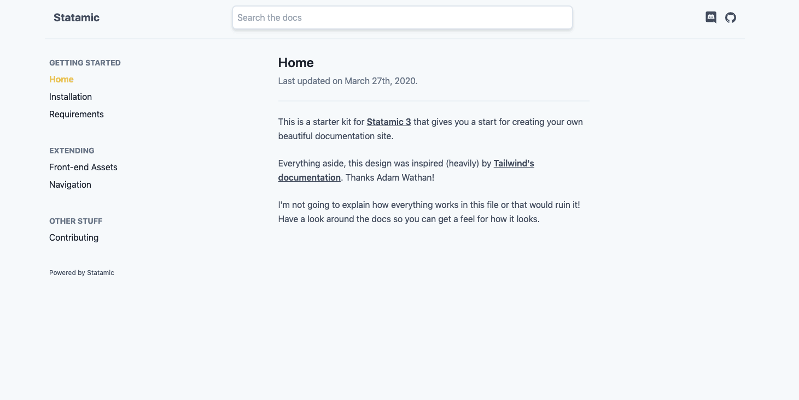

<h1 align="center">Starter Kit: Documentation</h1>


## Features

* Beautiful design (inspired by the [Tailwind v0 docs](https://tailwindcss-v0.netlify.app/docs/what-is-tailwind/))
* Built with Tailwind CSS and Vanilla JS
* Responsive
* Compatible with Statamic's [static site generator](https://github.com/statamic/ssg)

## Screenshot



## Quick Start

### 1. Create a new site

You can create a new site using the [Statamic CLI Tool](https://github.com/statamic/cli):

```
statamic new your-site doublethreedigital/docs-starter-kit
```

Or you can install manually into a fresh [Statamic installation](https://statamic.dev/installation) by running:

```
php please starter-kit:install doublethreedigital/docs-starter-kit --clear-site
```

### 2. Make a new user

The above installers should prompt you to make a user, but you can also run `php please make:user`. You'll want it to be a `super` so you have access to everything.

### 3. Recompile the CSS (optional)

The [TailwindCSS](https://tailwindcss.com/) included in this kit is compiled with [PurgeCSS](https://purgecss.com/) to reduce filesize on any unused classes and selectors. If you want to modify anything, just recompile it.

```
npm i && npm run dev
```

To compile for production again:

```
npm run production
```

### 4. Do your thing!

If you're using [Laravel Valet](https://laravel.com/docs/valet) (or similar), your site should be available at `http://cool-site.test`. You can access the control panel at `http://cool-site.test/cp` and login with your new user. Open up the source code, follow along with the [Statamic 3 docs](https://statamic.dev), and enjoy!

## Contributing

Contributions are always welcome! No matter how large or small. Before contributing, please read through the [contributor guide](https://github.com/doublethreedigital/.github/blob/main/.github/CONTRIBUTING.md). Thanks!
